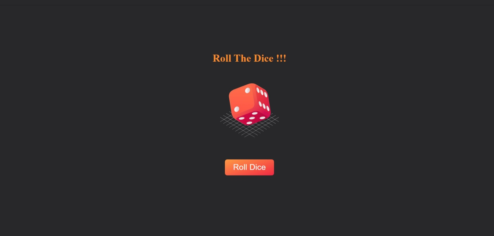

# *Dice Roller*

### A dice roller tool is a simple utility that simulates the rolling of a dice, typically a six-sided one, but it can be extended to other types of dice as well. 

**Best Practices :**

- Modularity: Break down your code into small, reusable functions. For example, separate the logic for rolling a single die and rolling multiple dice.

- Input Validation: Validate inputs to ensure the number of dice and sides are positive integers.